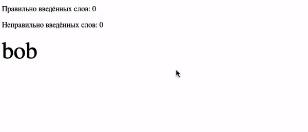

# Соло на клавиатуре

Домашнее задание к занятию 1.3 «Объект события».

## Описание 

Необходимо __дописать__ игру, в которой пользователь вводит слово по буквам с клавиатуры.
В случайное время появляется фраза. Если игрок вводит не так слово, 
ему засчитываeтся поражение. После 3 поражений игра заканчивается. 
Игрок побеждает после 10 побед.

### Исходные данные

1. Основная HTML-разметка
2. Базовая CSS-разметка
3. Базовый код игры

В настоящий момент в коде игры не хватает только обработчика ввода с клавиатуры 
для распознавания введённых символов и сравнении с текущим.

### Процесс реализации

Допишите метод *registerEvents*, в котором необходимо задать обработчик
нажатия клавиш. Принцип работы метода:

1. Получить DOM-элемент текущего символа, который необходимо ввести (свойство *this.currentSymbol*)
2. Получить символ, который был введён с клавиатуры. 
3. Если два символа одинаковые, вызывать метод *this.success*
4. Если два символа отличаются, вызвать метод *this.fail*
5. При сравнении регистр не должен быть важен (а или А)

### Повышенный уровень сложности (не обязательно)

Добавьте таймер обратного отсчёта в код (внесите правки в HTML и CSS).
Любой текст не должен вводиться более, чем за N секунд, где N - количество символов
в тексте.

### Повышенный уровень сложности #2 (не обязательно)

Сделайте задачу с нуля без ранее написанного кода. 
Для работы вам потребуется понимание свойства *innerHTML*
(будет изучаться в следующих лекциях). Вот несколько источников:

1. [MDN: Element.innerHTML](https://developer.mozilla.org/ru/docs/Web/API/Element/innerHTML)
2. [Свойства узлов: тип, тег и содержимое](https://learn.javascript.ru/basic-dom-node-properties)

### Повышенный уровень сложности #3 (не обязательно)

Задача для адептов JavaScript: сделайте возможным работу как с русскими, английскими, так и смешанными фразами
(например, «я люблю kitkat»). Обратите внимание, что коды клавиш, которые
получаются при прослушивании событий с клавиатуры, 
одинаковые для русской и англиской раскладок.

В качестве вспомогательных инструментов вам может пригодиться [таблица символов
кодировки UTF-16](https://www.fileformat.info/info/charset/UTF-16/list.htm).
Именно эту кодировку использует JavaScript.

При необходимости, вы можете править HTML и CSS.

## Подсказки (спойлеры)

Используемые темы

1. Событие *click*, метод *addEventListener*, обработчик события
2. Свойство *textContent*
3. Метод Array.from() или оператор распространения (spread, «...») для удобной
   навигации по найденным элементам
4. Метод [String.fromCharCode()](https://developer.mozilla.org/ru/docs/Web/JavaScript/Reference/Global_Objects/String/fromCharCode) 
5. Метод [String.charCodeAt()](https://developer.mozilla.org/ru/docs/Web/JavaScript/Reference/Global_Objects/String/charCodeAt)
 
   

Советы

1. Для того, чтобы получить из клавиатурного кода символ, используйте
метод Метод [String.fromCharCode()](https://developer.mozilla.org/ru/docs/Web/JavaScript/Reference/Global_Objects/String/fromCharCode) 
2. Обратите внимание, что регистр вводимых символов может отличаться
от того, что будет представлен на экране. Для надёжности приводите
и символ, вводимый с клавиатуры и тот, что на экране к верхнему или нижнему
регистрам.
   

## Решение задач
1. Перейти в папку задания. `cd ./event-object/keysolo`.
2. Открыть файл `task.js` в вашем редакторе кода и выполнить задание.
3. Открыть файл `task.html` в вашем браузере и убедиться в правильности выводимых результатов.
4. Добавить файл `task.js` в индекс git с помощью команды `git add %file-path%`, где %file-path% - путь до целевого файла. `git add task.js`.
5. Сделать коммит используя команду `git commit -m '%comment%'`, где %comment% - это произвольный комментарий к вашему коммиту. `git commit -m 'first commit keysolo'`.
6. Опубликовать код в репозиторий homeworks с помощью команды `git push -u homeworks master`.
7. Прислать ссылку на репозиторий через личный кабинет на сайте [Нетологии][6].

[0]: https://github.com/
[1]: https://www.sublimetext.com/
[2]: https://code.visualstudio.com/
[3]: https://github.com/netology-code/guides/tree/master/github
[4]: https://git-scm.com/
[5]: https://github.com/netology-code/guides/blob/master/git/REAMDE.md
[6]: https://netology.ru/

*Никаких файлов прикреплять не нужно.*

Все задачи обязательны к выполнению для получения зачета. Присылать на проверку можно каждую задачу по отдельности или все задачи вместе. Во время проверки по частям ваша домашняя работа будет со статусом "На доработке".

Любые вопросы по решению задач задавайте в группе на Facebook.
